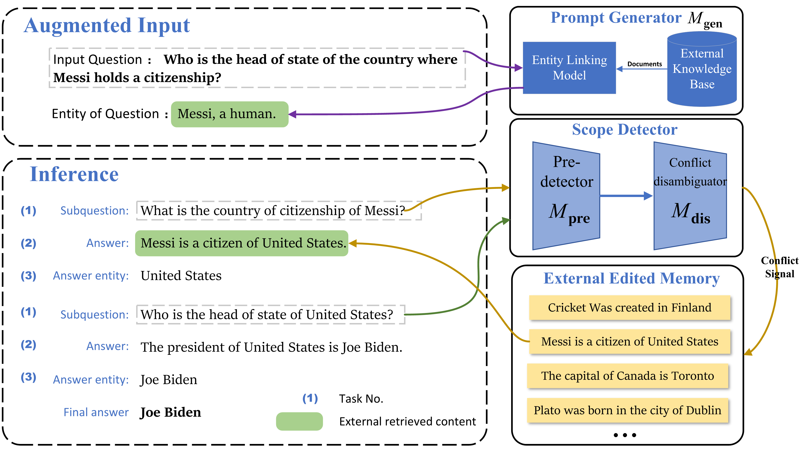

# PokeMQA


This is the repository for our paper [PokeMQA: Programmable knowledge editing for Multi-hop Question Answering](https://arxiv.org/abs/2312.15194).

We release the `PokeMQA-turbo_n_edited.py` to run PokeMQA on `GPT-3.5-turbo-instruct`.

## Training Dataset for Scope Detector
In `datasets\`, we release the dataset `cls-filtered.json` for training scope detector (mentioned in Section 3.2). The details on the dataset construction are illustrated in Appendix B.

### Format
Each instance in `cls-filtered.json` represents a (1edit,4questions) pair:
```
{
"edit": "Carl Sagan is employed by British Broadcasting Corporation",
"questions":
[
"Who is the employer of Carl Sagan?",
"What is the name of the organization where Carl Sagan works?",
"Which organization employs Carl Sagan?",
"Where does Carl Sagan work?"
]
}
```

* `edit`: an edit $e$ in natural language form extracted from [MQuAKE-CF](https://github.com/princeton-nlp/MQuAKE/tree/main).
* `questions`: four atomic questions belonging to the scope $S(e)$, three of which are generated by `Vicuna-13B`, another one by manully-defined template.
  
## Pregenerated Knowledge Prompt
We propose knowledge prompt generator (Section 3.3) to enrich contextual information. Specifically, we leverage [ELQ](https://github.com/facebookresearch/BLINK/tree/main/elq), an off-the-shelf entity linking model. It recognizes the key entity in multi-hop questions, links it to Wikidata, and then retrieves the related knowledge facts to construct knowledge prompt. Here we provide the pregenerated knowledge prompt for both MQA dataset, [MQuAKE-CF-3k](https://github.com/princeton-nlp/MQuAKE/tree/main) and [MQuAKE-T](https://github.com/princeton-nlp/MQuAKE/tree/main) in `kgprompt\`.

## Commands
To run PokeMQA:
```python
# Start by finetuning distilbert to get pre-detector & conflict disambiguator
OPENAI_API_KEY=YOUR-API-KEY python -m PokeMQA-turbo_n_edited --edited-num 1 --dataset MQuAKE-CF-3k --retraining_detector --retraining_disambiguator --activate_kgprompt

# Skip the finetune stage and load the existing checkpoint of scope detector
OPENAI_API_KEY=YOUR-API-KEY python -m PokeMQA-turbo_n_edited --edited-num 3000 --dataset MQuAKE-CF-3k --detector_name detector-ckpt --dis_name dis-ckpt --activate_kgprompt
```
If you have any questions about our paper, feel free to email Hengrui Gu `guhr22@mails.jlu.edu.cn`.
## Citation
If you use our code in your research, please cite our work:
```bibtex
@article{gu2023pokemqa,
  title={PokeMQA: Programmable knowledge editing for Multi-hop Question Answering},
  author={Gu, Hengrui and Zhou, Kaixiong and Han, Xiaotian and Liu, Ninghao and Wang, Ruobing and Wang, Xin},
  journal={arXiv preprint arXiv:2312.15194},
  year={2023}
}
```
